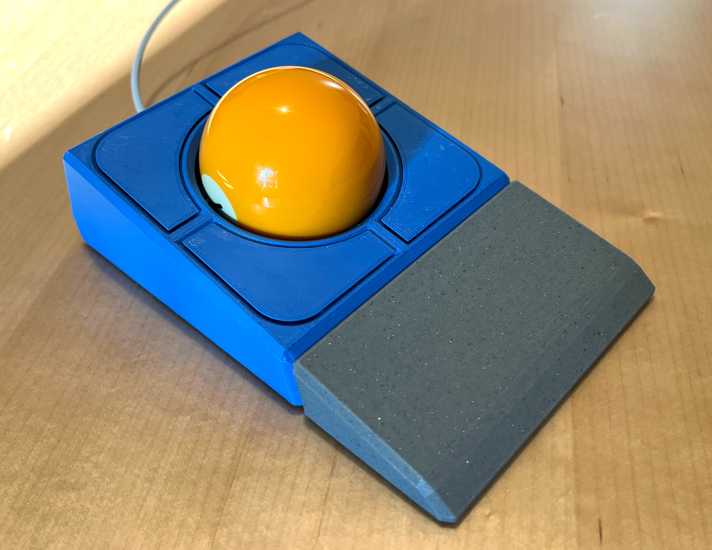
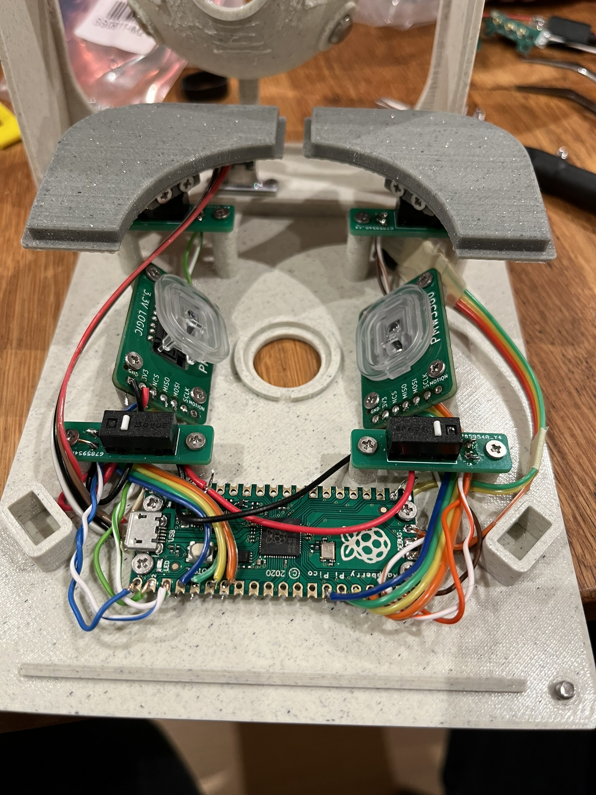
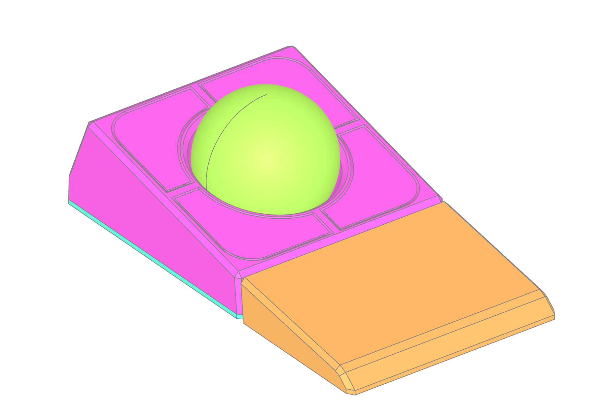
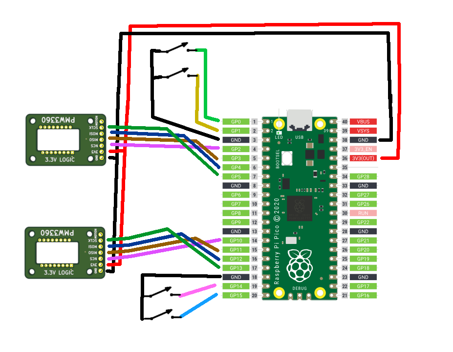
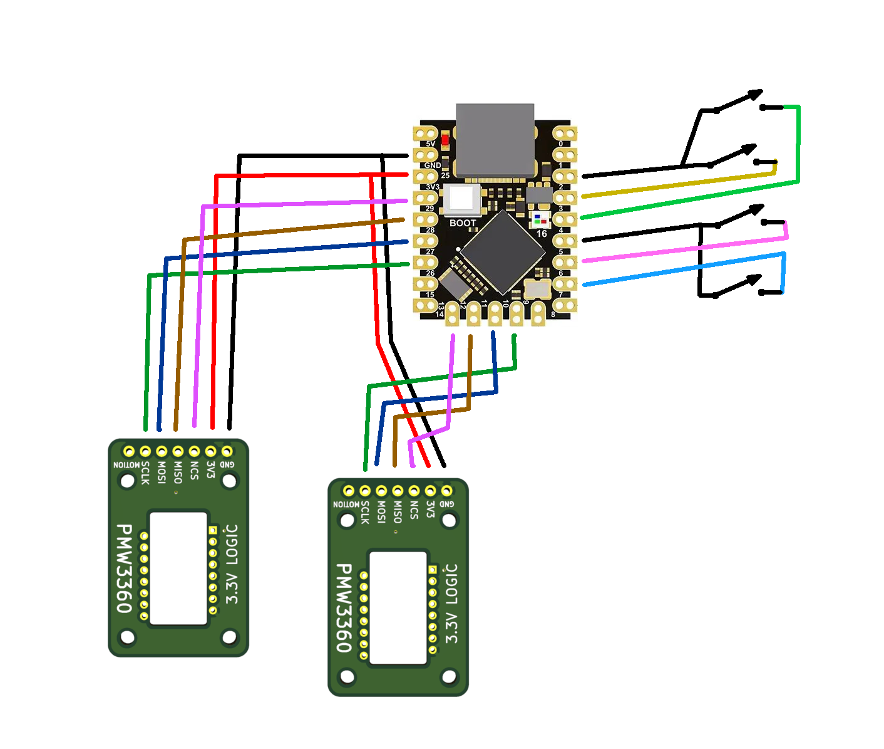
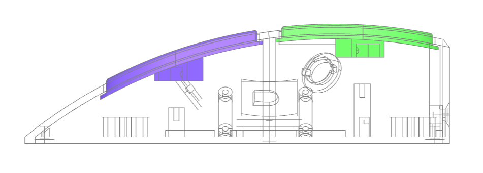
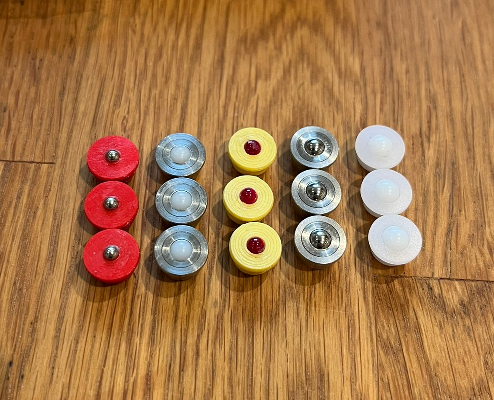
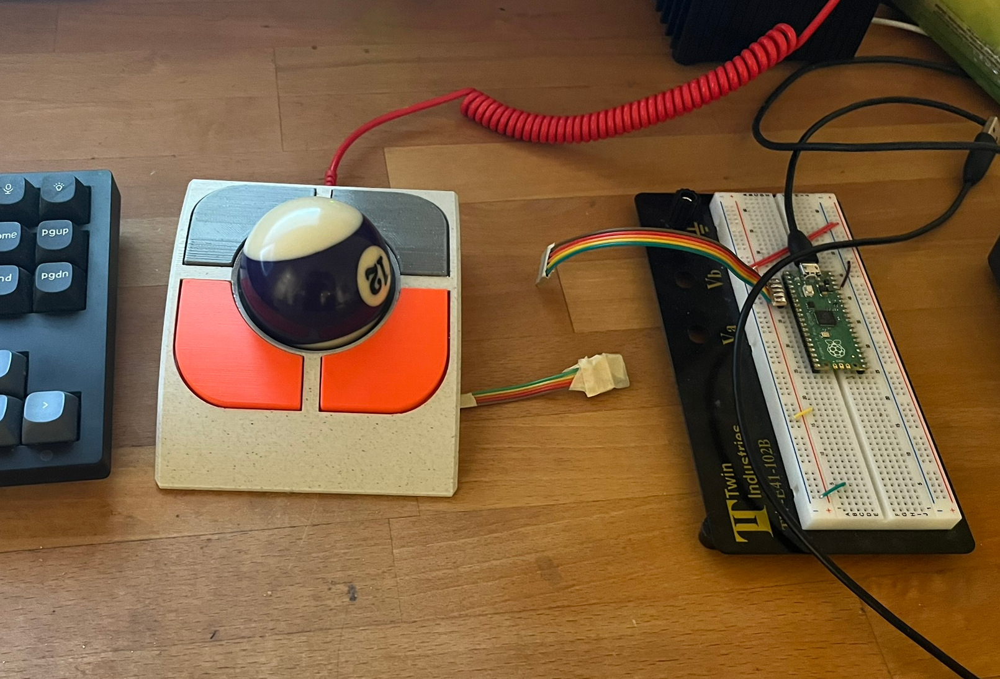
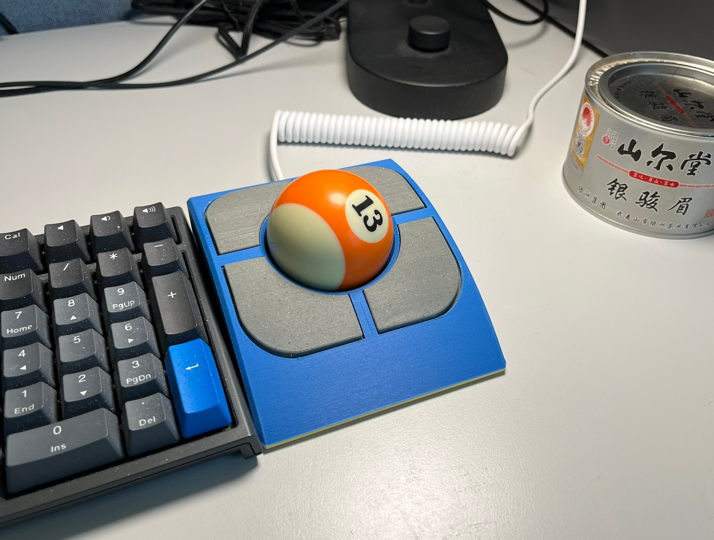

# Trackball

## News
- 2025-12-25: I'm releasing a new version (Mk.II) that should be easier to print and build.

## Introduction

*(This is still work in progress)*

This is a 3d-printable twist-to-scroll trackball using a Raspberry Pi Pico and two PMW3360 sensors designed using [build123d](https://github.com/gumyr/build123d).



It's based on [jfedor2](https://github.com/jfedor2)'s excellent set of projects.
In particular it's using 2 [PMW3360 breakout PCBs](https://github.com/jfedor2/pmw3360-breakout) and 4 [mouse buttons switch mount PCBs](https://github.com/jfedor2/mouse-switch-mount-pcb). It's also using a firmware derived from his [twist-to-scroll trackball](https://github.com/jfedor2/twist-to-scroll-trackball) project.

However there's a number of pretty major changes:

Instead of a [RP2040+PMW3360](https://github.com/jfedor2/rp2040-pmw3360) board I'm using a regular Raspberry Pi Pico.



I redesigned the entire enclosure from the ground up in build123d. The nice thing about this is that it should be possible to parameterize the generated model (for instance to use a 55mm trackball instead of a 57.2mm billiards ball or to change the type of bearing used).

The button assembly is quite different and feels a lot better in my opinion.

The sensors are arranged at a 45-degree angle to move them as low as possible and keep them out of the way of the button assembly.
This means when reading from the sensors, some axis values (the X and Z axis) need to be reconstructed from a combination values from both sensors.

This is done in firmware. The basic math isn't too complicated, but it meant that the time delay between reading both sensors should be minimal or else the time lag might show up as unintended twists around the Z axis.
To improve this I interleaved the sensor access. I also switched from RP2040 HW SPI to PIO SPI which allowed for more flexible GPIO mapping.

## Configuring and generating the models



The enclosure parts are generated by the `trackball.py` (Mk.I trackball) and `trackball2.py` (Mk.II) scripts.
They use `build123d` and I generally recommend using `uv` to run them like this:
You can generate the `STL` or `STEP` files by calling

```
$ uv run --with build123d trackball.py --step --outdir mk1
```
or
```
$ uv run --with build123d trackball2.py --step --outdir mk2
```

This generates `.step` model files in the `mk1` and `mk2` subdirs respectively.
You can also use PyPI or Conda to install `build123d` instead.

There's more configuration options. Call the scripts with `--help` for details.

```
usage: trackball.py [-h] [-o OUTDIR] [--stl] [--step] [--ballsize BALLSIZE]
                    [--suspension_type {BEARING_BALL,BALL_TRANSFER_UNIT}]
                    [--cable_mount_type {HOLE,USBC_PLUG,RP2040_SUPERMINI}] [--switch_pcb_type {JFEDOR2,G304}]
                    [--bearing BEARING]

Generates trackball parts

optional arguments:
  -h, --help            show this help message and exit
  -o OUTDIR, --outdir OUTDIR
                        Output directory
  --stl                 Generate STL files
  --step                Generate STEP files
  --ballsize BALLSIZE   Size of trackball in mm
  --suspension_type {BEARING_BALL,BALL_TRANSFER_UNIT}
                        Suspension type
  --cable_mount_type {HOLE,USBC_PLUG,RP2040_SUPERMINI}
                        Cable mount type
  --switch_pcb_type {JFEDOR2,G304}
                        Keyswitch PCB type
  --bearing BEARING     Bearing ball size (only used for static BEARING_BALL suspension)
```

## Building the firmware

To build the firmware you need to have `pico-sdk` installed.
Then configure and build using CMake:

```
cd firmware
mkdir build
cd build
cmake .. -DBOARD=<board_type> -DTRACKBALL=<trackball_version>
make -j8
```

This generates a `trackball.uf2` which you can upload to your board.

`<board_type>` is the type of microcontroller board you want to target. Possible options are `RPI_PICO` for a regular RaspberryPi Pico or `RP2040_SUPERMINI` for a RP2040 supermini board.
`<trackball_version>` is the version of the trackball to generate. This is either `MK_I` for the Mk.I version or `MK_II` for the Mk.II version.

## 3D printing (MK.I)
These are the parts you need to print:

* `bottom`
  * The base plate for the entire assembly. Doesn't need supports.
* `top`
  * The top cover of the trackball. Needs supports.
* `button0`, `button1`, `button2`, `button3`
  * The top buttons. Each one has a different curvature so they're not interchangeable. Need supports.
* `strip0`, `strip1`, `strip2`, `strip3`
  * The flexible springs to hold the button in place. You need 4 of these but they come in identical pairs (two shorter ones for the front and two longer ones for the back). Doesn't need supports when printed on the side.
* `adapter_XXmm` (optional)
  * Adapter if you want to use a static bearing to hold the trackball (instead of a BTU)

I printed everything with PLA and a layer size of 0.1mm.

The printed models shouldn't need too much cleanup apart from the contact surface between the buttons and the underside of the top cover.
Any residue supports must be removed. I found this area also needs a bit of manual filing and adjustment until the button clickiness feels right.
I used needle files for this.

## 3D printing (MK.II)
There's only two parts that need to be printed.

None should need support materials but a spot or two of organic supports for the openings in the bowl of the `top` part might result in cleaner prints.

* `bottom`
  * The base plate for the assembly
* `top`
  * The top cover and button assembly. This should be printed upside-down placed on its flat top surface.
* `wrist_rest` (optional)
  * This is an optional wrist-rest that attaches to the main unit with neodymium magnets.
* `adapter_XXmm` (optional)
  * Adapter if you want to use a static bearing to hold the trackball (instead of a BTU)
  * The `XXmm` number is the diameter of the bearing. So for instance `adapter_2.5mm` is for 2.5mm bearing balls.

## Parts

Apart from the 3d-printed parts you need the following:

* 1 microcontroller board. Either:
  * A RaspberryPi Pico
    This should be easy to find but you will need to do some extra soldering for the USB cable.
  * A [RP2040 Supermini](https://www.eelectronicparts.com/products/rp2040-super-mini-pico-compatible-with-raspberry-pi-micro-python-2mb-flash)
    This plugs directly into the USB socket in the back of the trackball so less soldering necessary.
	`--cable-mount-type RP2040_SUPERMINI`
* 2 [PMW3360 breakout PCBs](https://github.com/jfedor2/pmw3360-breakout) with a PMW3360 sensor soldered in.
  These will need to be ordered from a service like JLCPCB or PCBWay. You will find the Gerber files and BOM on jfedor's github.
* 4 keyswitch mount PCBs with a D2F type switch. You have two options here:
  * Custom order jfedor's [mouse switch mount PCB](https://github.com/jfedor2/mouse-switch-mount-pcb)
    `--switch_pcb_type JFEDOR2`
  * Buy 2 pairs of [G304/G305 button replacement PCBs](https://vi.aliexpress.com/item/1005004663221786.html).
    `--switch_pcb_type G304`
* 1 57.2mm billiards ball
  * Or a 55mm trackball if you adjust the ball size in the script
* 3 YK310 type BTUs (or steel/ruby/ceramic bearings with an adapter)
* 4 10x2mm cylindric neodymium magnets (for attaching wrist-rest in Mk.II)
  * The magnets in the main unit can also be thicker
* Machine screws
  * M3x4 (For bottom screws)
  * M2x3 (For almost everything else)
  * M1.6x3 (In case you use G304/G305 button PCBs)
* A [USB-C socket](https://vi.aliexpress.com/item/1005007593502706.html)
  * in case you use a RaspberryPi Pico board.
* Various cabling and solder supplies
  * I recommend getting pairs of JST male/female cables so breakout boards can be attached after soldering.
* Some adhesive rubber feet or strips so the trackball doesn't slip.

## Wiring

Here's some rough wiring diagrams for both board configurations.
You can change the GPIO pins used in `firmware/src/trackball.cc` if you want to move things around.

I recommend using JST cables to connect the microcontroller and the breakout boards.

### Wiring (RaspberryPi Pico)


### Wiring (RP2040 Supermini)


## Assembly

Once you printed out your parts and wired everything up you should be ready to assemble your trackball.
This should hopefully be relatively straightforward.

* Screw the various boards to the bottom plate.
* Screw flexible strips to the button parts and place the assembled buttons over the switches.
* Place the top part over everything and secure it with the screws on the bottom (and back).
* Push in your bearing of choice.

You can open all the model files in a 3d editor like blender to see where everything goes.

The bit that's probably easiest to mix up is which button goes where. The best way to tell which is which is to look at their curvature. Front buttons have a much steeper angle and the lowest part protudes below the attachment point for the flexible strip.
You should also be able to tell by the layer lines from the 3d print.



## Minor tips and tricks

The trackball can be configured to either use ball transfer units (7.5mm [YK310 or YK311](https://www.aliexpress.com/item/1005005528750648.html) type from aliexpress) or have small indentations to press in small steel or zirconium bearing balls.

However I found it's most flexible to just adapt an enclosure for ball transfer units to bearing balls using a small 3d-printed adapter.



You can find the pregenerated models for the adapter in the `stl` and `step` folders and the script to generate it in `adapter.py`.

## Experience


I've been using the Mk.I trackball for about a year now. Initially I was kind of struggling finding a type of bearing I like.
At least the cheap BTUs didn't quite feel right. I ended up with using static ruby bearings for my current setup which I tend to like best.
The pool balls I'm using aren't the highest quality and noticeable uneven in places. I should eventually try to get something better. (I ordered a set of Kandy Pearlized balls that got recommended, but these didn't seem to work with my PMW3360 sensors)




### Update
The Mk.II version is significantly easier to build and the button reach and feel is better.
Honestly it's an all-around better design.

<video src="img/mkii_in_action.mp4" width="480" height="480" controls></video>


## Future Ideas

My next big project will be a combined keyboard+trackball device. This will likely live in a separate github project though.

I'd like to make a magnetically attached top cover for easy transport.

The firmware could need quite a bit of cleanup.
Alternatively adding support for this trackball in QMK might also be an option.
I've created a [rough patch to QMK](https://github.com/ginkgo/qmk_firmware/tree/trackball) but this will need to be reworked to get it merged upstream. It'll also need changes to how sensors are connected to the SoC.

Using PIO it should be possible to access both sensors in perfect lock-step by having them share a single SCLK, NCS, and MOSI pin and having two separate MISO pins that are read at once.

In principle it should be possible to CNC machine all parts for the Mk.I trackball in metal. (Mk.II is trickier) This would likely need a bit of cleanup to some parts but nothing major.

## Support

If you need help with building this then you can reach me on the [/r/trackballs](https://discord.gg/772eGUxAUb) Discord server.
Alternatively you can also create a discussion thread here.

If you have suggestions for improvements feel free to open an issue or create a pull request.

## License

The 3d-printable parts as well as the python code to generate thes is copyright 2024 Thomas Weber and licensed under terms the MIT license.

The firmware is copyright 2024 Thomas Weber, copyright 2021 Jacek Fedoryński (jfedor2), and copyright 2019 Ha Thach (tinyusb.org) and licensed under the terms of the MIT license.
There is also a piece of code for the SPI PIO copyright 2020 of the Raspberry Pi that's licensed under the terms of the BSD-3-Clause license.
