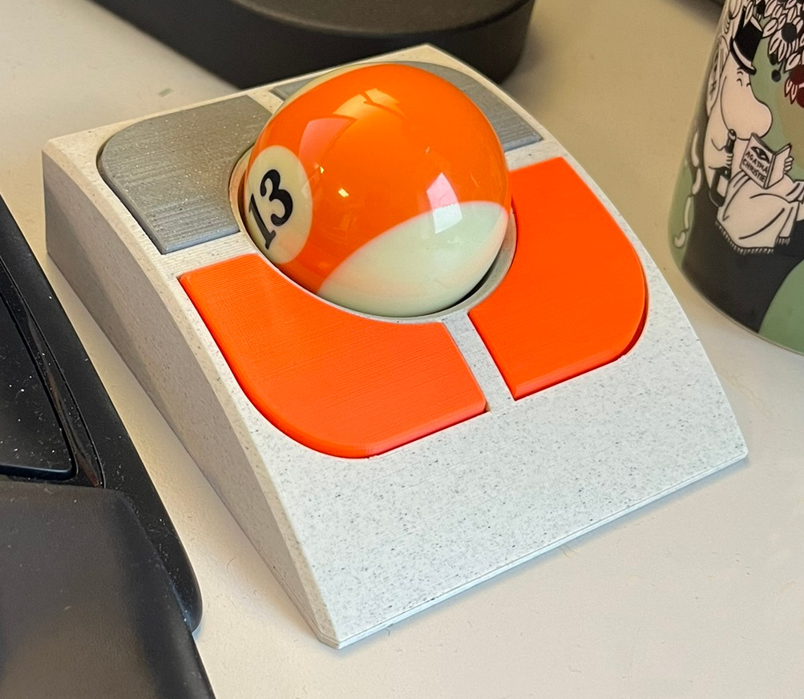
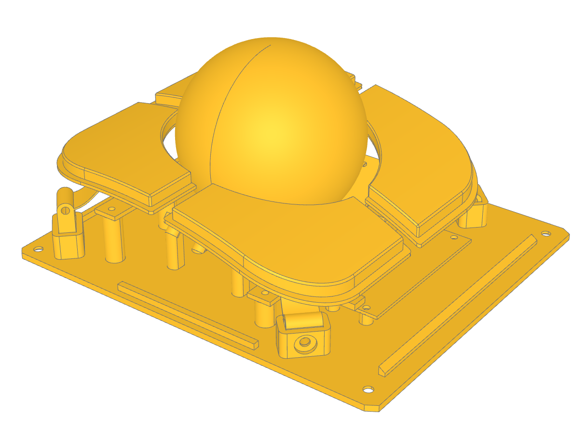

# Trackball
(README still under construction)

This is a 3d-printable twist-to-scroll trackball using a Raspberry Pi Pico and two PMW3360 sensors designed using [build123d](https://github.com/gumyr/build123d).



It's based on [jfedor2](https://github.com/jfedor2)'s excellent set of projects.
In particular it's using 2 [PMW3360 breakout PCBs](https://github.com/jfedor2/pmw3360-breakout) and 4 [mouse buttons switch mount PCBs](https://github.com/jfedor2/mouse-switch-mount-pcb). It's also using a firmware derived from his [twist-to-scroll trackball](https://github.com/jfedor2/twist-to-scroll-trackball) project.

However there's a number of pretty major changes:

Instead of a [RP2040+PMW3360](https://github.com/jfedor2/rp2040-pmw3360) board I'm using a regular Raspberry Pi Pico.


I redesigned the entire enclosure from the ground up in build123d. The nice thing about this is that it should be possible to parameterize the generated model (for instance to use a 55mm trackball instead of a 57.2mm billiards ball or to change the type of bearing used).

The button assembly is quite different and feels a lot better in my opinion.

The sensors are arranged at a 45-degree angle to move them as low as possible and keep them out of the way of the button assembly.
This means when reading from the sensors, some axis values (the X and Z axis) need to be reconstructed from a combination values from both sensors.

This is done in firmware. The basic math isn't too complicated, but it meant that the time delay between reading both sensors should be minimal or else the time lag might show up as unintended twists around the Z axis.
To improve this I interleaved the sensor access. I also switched from RP2040 HW SPI to PIO SPI which allowed for more flexible GPIO mapping.

## Configuring and renerating the models



The enclosure parts are all defined in the `trackball.py` file.

You can generate the `STL` or `STEP` files by calling

```
$ python3 trackball.py STL
```
or
```
$ python3 trackball.py STEP
```
respectively from a python environment with `build123d` available.
(I personally use STEP since export is faster and my slicing tool takes it just fine)

All the major configuration options can be found in the beginning of the file. The most important ones are probably the trackball diameter and the type of suspension and cable mount to use.

By default we use a 57.2mm billiards size ball, a ball transfer unit suspension and set up an opening for a [USB-C plug](https://www.aliexpress.com/item/1005007593502706.html).
```
BALL = 57.2
suspension_type = SuspensionType.BALL_TRANSFER_UNIT
cable_mount_type = CableMountType.USBC_PLUG
```

## Building the firmware

## 3D printing

## Parts

## Assembly

## Minor tips and tricks

The trackball can be configured to either use ball transfer units (7.5mm [YK310 or YK311](https://www.aliexpress.com/item/1005005528750648.html) type from aliexpress) or have small indentations to press in small steel or zirconium bearing balls.

However I found it's most flexible to just adapt an enclosure for ball transfer units to bearing balls using a small 3d-printed adapter.


You can find the pregenerated models for the adapter in the `stl` and `step` folders and the script to generate it in `adapter.py`.

## Experience


## Future Work

I'm planning to make a wrist-rest that attaches using neodymium magnets in the enclosure. I'd probably try printing it in TPU.

Similarly I'd like to make a magnetically attached top cover for easy transport.

The firmware could need quite a bit of cleanup.

I've used jfedor2's mouse switch PCBs since I already had them lying around, but I think for someone making their own trackball it would make more sense to use some of the very cheaply available G304/G305 mouse switch kits (like [this](https://www.aliexpress.com/item/1005006636817494.html) one) instead. These come with switches and allow hot swap.
This would need slight changes to the model.

Similarly it might be possible to save on soldering a breakout USB cable and USB-C jack if we could instead use another smaller RP2040 board that already comes with a USB-C jack.

I don't yet know how durable the 3d-printed PLA springs holding the buttons in place will be (I guess it's easy to just reprint them if they break) but if this turns out to be a common point of failure it might be possible to replace them with a strip of steel.

Using PIO it should be possible to access both sensors in perfect lock-step by having them share a single SCLK, NCS, and MOSI pin and having two separate MISO pins that are read at once.

## License

The 3d-printable parts as well as the python code to generate thes is copyright 2024 Thomas Weber and licensed under terms the MIT license.

The firmware is copyright 2024 Thomas Weber, copyright 2021 Jacek Fedoryński (jfedor2), and copyright 2019 Ha Thach (tinyusb.org) and licensed under the terms of the MIT license.
There is also a piece of code for the SPI PIO copyright 2020 of the Raspberry Pi that's licensed under the terms of the BSD-3-Clause license.
