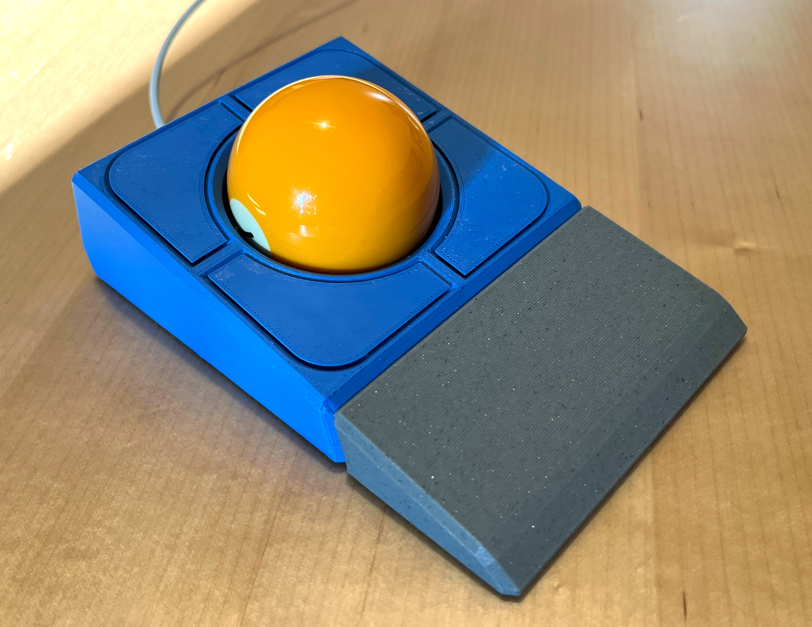

# Trackball

## News
- 2025-12-25: I'm releasing a new version (Mk.II) that should be easier to print and build.

## Introduction

This is a 3d-printable twist-to-scroll trackball using a Raspberry Pi Pico and two PMW3360 sensors designed using [build123d](https://github.com/gumyr/build123d).

## Build Instructions

You can find build instructions for the latest version here: [Mk.II Build Instructions](trackball_mkii.md)

In case you're interested in the original version you can find it [here](trackball_mki.md).

## General Info

It's based on [jfedor2](https://github.com/jfedor2)'s excellent set of projects.
In particular it's using 2 [PMW3360 breakout PCBs](https://github.com/jfedor2/pmw3360-breakout) and 4 [mouse buttons switch mount PCBs](https://github.com/jfedor2/mouse-switch-mount-pcb). It's also using a firmware derived from his [twist-to-scroll trackball](https://github.com/jfedor2/twist-to-scroll-trackball) project.

However there's a number of pretty major changes:

Instead of a [RP2040+PMW3360](https://github.com/jfedor2/rp2040-pmw3360) board I'm using a regular Raspberry Pi Pico.

I redesigned the entire enclosure from the ground up in build123d. The nice thing about this is that it should be possible to parameterize the generated model (for instance to use a 55mm trackball instead of a 57.2mm billiards ball or to change the type of bearing used).

The button assembly is quite different and feels a lot better in my opinion.

The sensors are arranged at a 45-degree angle to move them as low as possible and keep them out of the way of the button assembly.
This means when reading from the sensors, some axis values (the X and Z axis) need to be reconstructed from a combination values from both sensors.

This is done in firmware. The basic math isn't too complicated, but it meant that the time delay between reading both sensors should be minimal or else the time lag might show up as unintended twists around the Z axis.
To improve this I interleaved the sensor access. I also switched from RP2040 HW SPI to PIO SPI which allowed for more flexible GPIO mapping.

## Future Ideas

My next big project will be a combined keyboard+trackball device. This will likely live in a separate github project though.

I'd like to make a magnetically attached top cover for easy transport.

The firmware could need quite a bit of cleanup.
Alternatively adding support for this trackball in QMK might also be an option.
I've created a [rough patch to QMK](https://github.com/ginkgo/qmk_firmware/tree/trackball) but this will need to be reworked to get it merged upstream. It'll also need changes to how sensors are connected to the SoC.

Using PIO it should be possible to access both sensors in perfect lock-step by having them share a single SCLK, NCS, and MOSI pin and having two separate MISO pins that are read at once.

## Support

If you need help with building this then you can reach me on the [/r/trackballs](https://discord.gg/772eGUxAUb) Discord server.
Alternatively you can also create a discussion thread here.

If you have suggestions for improvements feel free to open an issue or create a pull request.

## License

The 3d-printable parts as well as the python code to generate thes is copyright 2024 Thomas Weber and licensed under terms the MIT license.

The firmware is copyright 2024 Thomas Weber, copyright 2021 Jacek Fedoryński (jfedor2), and copyright 2019 Ha Thach (tinyusb.org) and licensed under the terms of the MIT license.
There is also a piece of code for the SPI PIO copyright 2020 of the Raspberry Pi that's licensed under the terms of the BSD-3-Clause license.
