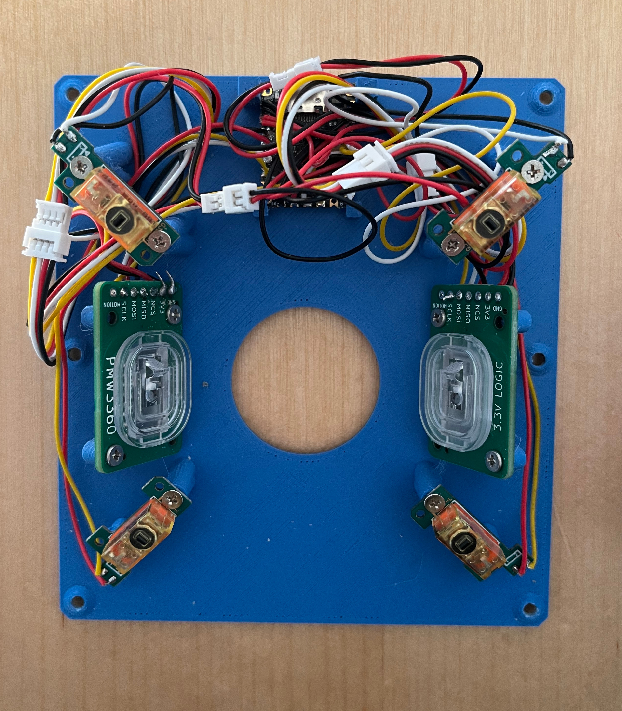
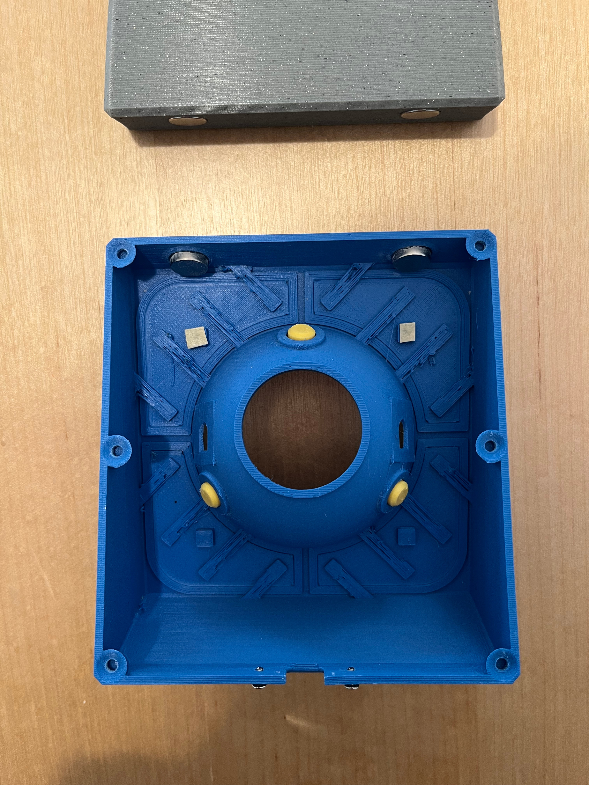

# Trackball Mk.II

This is the latest version of my DIY trackball. 


This version is designed so that the entire top assembly including buttons can be printed upside down in one piece. That way what used to be 9 parts that were somewhat fiddly to screw together and assemble are now a single easy to print part.
No support material should be needed for printing either.

Personally I feel like this is the allround better design. Use this unless you really like the look of the old version.

## Getting started

You can download tarballs with pregenerated parts and firmware under "Releases". 
If you want to do this yourself you can find details further below.

## 3D printing
There's only two parts that need to be printed (`bottom` and `top`). The rest are optional.

None should need support materials but a spot or two of organic supports for the openings in the bowl of the `top` part might result in cleaner prints.

* `top`
  * The top cover and button assembly. This should be printed upside-down placed on its flat top surface.
* `bottom`
  * The base plate for the assembly
* `wrist_rest` (optional)
  * This is an optional wrist-rest that attaches to the main unit with neodymium magnets.
* `adapter_X.Ymm` (optional)
  * Adapter if you want to use a static bearing to hold the trackball (instead of a BTU)
  * The `X.Ymm` number is the diameter of the bearing. So for instance `adapter_2.5mm` is for 2.5mm bearing balls.

## Parts

Apart from the 3d-printed parts you need the following:

* A [RP2040 Supermini](https://www.eelectronicparts.com/products/rp2040-super-mini-pico-compatible-with-raspberry-pi-micro-python-2mb-flash)
    This plugs directly into the USB socket in the back of the trackball so less soldering necessary.
* 2 [PMW3360 breakout PCBs](https://github.com/jfedor2/pmw3360-breakout) with a PMW3360 sensor soldered in.
  These will need to be ordered from a service like JLCPCB or PCBWay. You will find the Gerber files and BOM on jfedor's github.
  The 1.9V voltage regulators used in the BOM weren't available when I ordered the boards so I replaced them with pad compatible 2V ones. This is within the allowed voltage range for the PMW3360.
* 4 keyswitch mount PCBs with a D2F type switch.
  * Buy 2 pairs of [G304/G305 button replacement PCBs](https://vi.aliexpress.com/item/1005004663221786.html).
    `--switch_pcb_type G304`
* 1 57.2mm billiards ball
* 3 YK310 type BTUs (or steel/ruby/ceramic bearings with an adapter)
* 4 10x2mm cylindric neodymium magnets
  * The magnets in the main unit can also be thicker
* Machine screws
  * M3x4 (For bottom screws)
  * M2x3 (For almost everything else)
  * M1.6x3 (In case you use G304/G305 button PCBs)
* Various cabling and solder supplies
  * I recommend getting pairs of JST male/female cables so breakout boards can be attached after soldering.
* Some adhesive rubber feet or strips so the trackball doesn't slip.

## Wiring

Here's some rough wiring diagrams for both board configurations.
You can change the GPIO pins used in `firmware/src/trackball.cc` if you want to move things around.

I recommend using JST cables to connect the microcontroller and the breakout boards.

### Wiring


## Assembly

Once you printed out your parts and wired everything up you should be ready to assemble your trackball.
This should hopefully be relatively straightforward.



* Screw the various boards to the bottom plate.
* Place the top part over everything and secure it with the screws on the bottom (and back).
* Push in your bearing of choice.

You can open all the model files in a 3d editor like blender to see where everything goes.

Depending on your print settings and keyswitches used there may be a tiny bit of wiggle room in the interface between the button pressing pad and the keyswitch. This may result in the button feeling a bit loose and not triggering when pressed on the very edge.

This is somewhat intentional to allow for adjustment. You can tune this by adding a few layers of adhesive tape as shown here:



## Minor tips and tricks

The trackball can be configured to either use ball transfer units (7.5mm [YK310 or YK311](https://www.aliexpress.com/item/1005005528750648.html) type from aliexpress) or have small indentations to press in small steel or zirconium bearing balls.

However I found it's most flexible to just adapt an enclosure for ball transfer units to bearing balls using a small 3d-printed adapter.


You can find the pregenerated models for the adapter in the `stl` and `step` folders and the script to generate it in `adapter.py`.

## Experience

The Mk.II version is significantly easier to build and the button reach and feel is better.
Honestly it's an all-around better design.

<video src="img/mkii_in_action.mp4" width="480" height="480" controls></video>


## Configuring and generating the models


The enclosure parts are generated by the `trackball2.py` script.
They use `build123d` and I generally recommend using `uv` to run them like this:
You can generate the `STL` or `STEP` files by calling

```
$ uv run --with build123d trackball2.py --step --outdir mk2
```

This generates `.step` model files in the`mk2` subdir.
You can also use PyPI or Conda to install `build123d` instead.

There's more configuration options. Call the scripts with `--help` for details. Most of these are only used by the Mk.I trackball script though.

One config option that is supported is `--split-buttons` that generates separate 1-2 layer fronts for the buttons so you can print them in a different color using a multi-material printer. (or a few manual filament changes).

## Building the firmware

To build the firmware you need to have `pico-sdk` installed.
Then configure and build using CMake:

```
cd firmware
mkdir build
cd build
cmake .. -DBOARD=<board_type> -DTRACKBALL=<trackball_version>
make -j8
```

This generates a `trackball.uf2` which you can upload to your board.

`<board_type>` is the type of microcontroller board you want to target. Possible options are `RPI_PICO` for a regular RaspberryPi Pico or `RP2040_SUPERMINI` for a RP2040 supermini board.
`<trackball_version>` is the version of the trackball to generate. This is either `MK_I` for the Mk.I version or `MK_II` for the Mk.II version.
